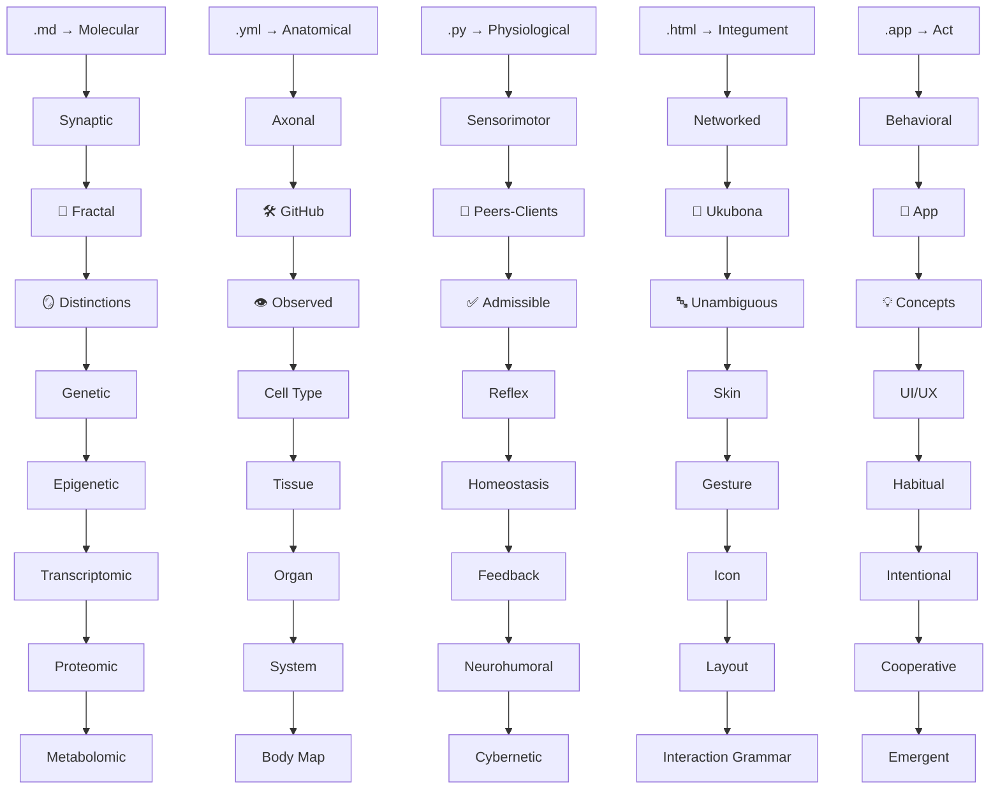

```mermaid

graph TD

  %% Column 1
  A1[.md → Molecular] --> B1[Synaptic]
  B1 --> C1[🧠 Fractal]
  C1 --> D1[🪞 Distinctions]
  D1 --> E1[Genetic]
  E1 --> F1[Epigenetic]
  F1 --> G1[Transcriptomic]
  G1 --> H1[Proteomic]
  H1 --> I1[Metabolomic]

  %% Column 2
  A2[.yml → Anatomical] --> B2[Axonal]
  B2 --> C2[🛠 GitHub]
  C2 --> D2[👁 Observed]
  D2 --> E2[Cell Type]
  E2 --> F2[Tissue]
  F2 --> G2[Organ]
  G2 --> H2[System]
  H2 --> I2[Body Map]

  %% Column 3
  A3[.py → Physiological] --> B3[Sensorimotor]
  B3 --> C3[🤝 Peers-Clients]
  C3 --> D3[✅ Admissible]
  D3 --> E3[Reflex]
  E3 --> F3[Homeostasis]
  F3 --> G3[Feedback]
  G3 --> H3[Neurohumoral]
  H3 --> I3[Cybernetic]

  %% Column 4
  A4[.html → Integument] --> B4[Networked]
  B4 --> C4[🏢 Ukubona]
  C4 --> D4[🔤 Unambiguous]
  D4 --> E4[Skin]
  E4 --> F4[Gesture]
  F4 --> G4[Icon]
  G4 --> H4[Layout]
  H4 --> I4[Interaction Grammar]

  %% Column 5
  A5[.app → Act] --> B5[Behavioral]
  B5 --> C5[📱 App]
  C5 --> D5[💡 Concepts]
  D5 --> E5[UI/UX]
  E5 --> F5[Habitual]
  F5 --> G5[Intentional]
  G5 --> H5[Cooperative]
  H5 --> I5[Emergent]

```
